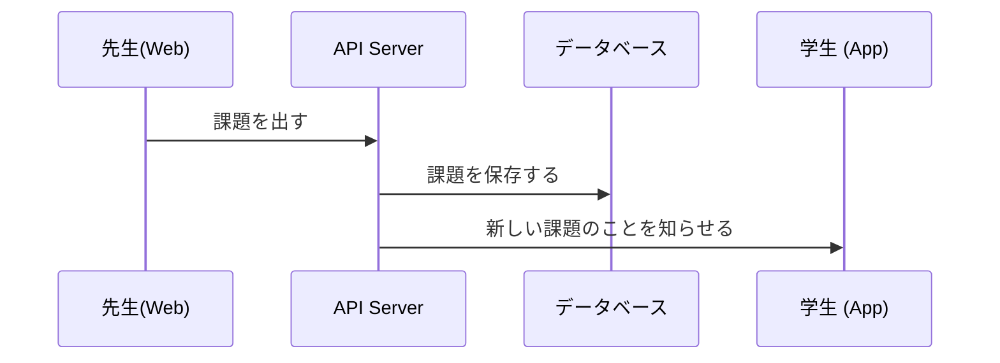
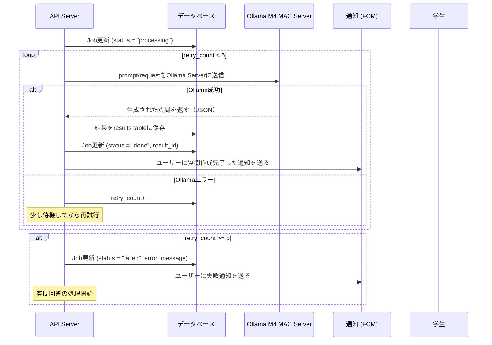
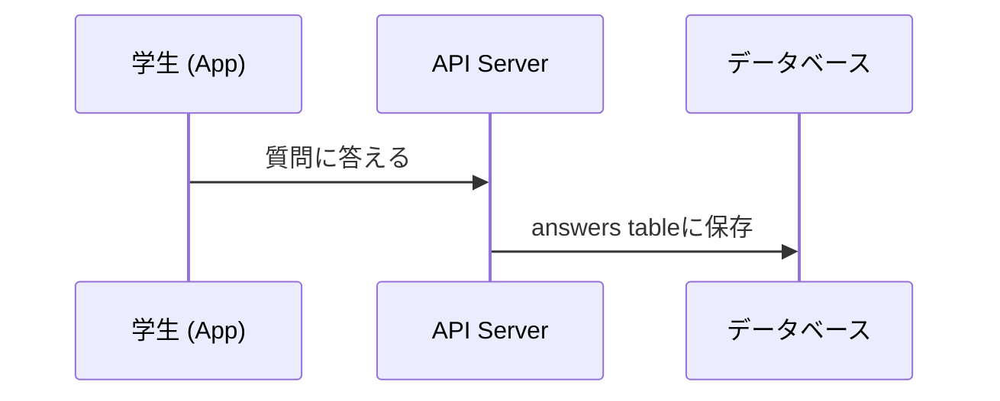
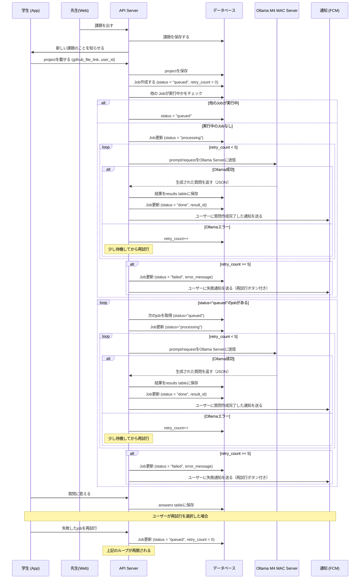

# Graduation-Project-System-design-


## 課題作成のフロー


---

## 課題提出とQueueのフロー
 ```mermaid
 sequenceDiagram
    participant S as 学生 (App)
    participant A as API Server
    participant DB as データベース
    
    S->>A: projectを載せる (github_file_link, user_id)
    A->>DB: projectを保存
    A->>DB: Job作成する (status = "queued", retry_count = 0)
    A->>DB: 他の Jobが実行中かをチェック
    
    alt 他のJobが実行中
        A->>DB: status = "queued"
    else 実行中のJobなし
        Note over A: 質問生成開始
    end
 ```

---

## 質問生成（Processing)フロー




---
## 質問回答の処理

---

## 全体フロー



[[Database]]
[[API実装]]
[[Cloudfare tunnel setting up]]
[[Ollama]]
